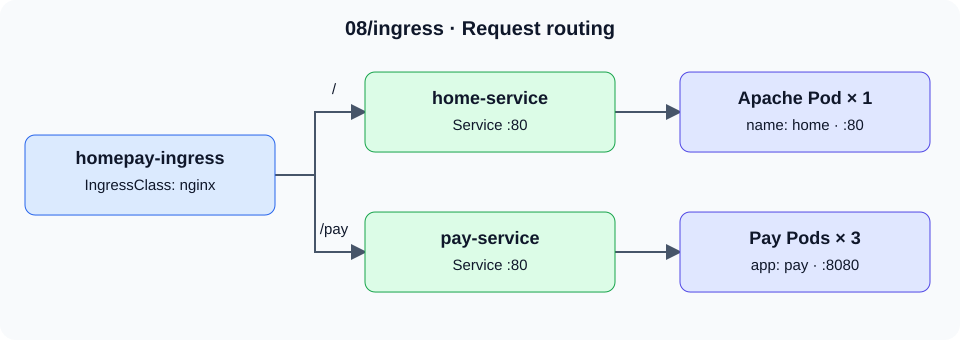

# Kubernetes 워크로드와 배포 구성 실습

Pod의 실행 조건부터 서비스 연결, 배포 전략, 스토리지, 스케줄링까지 Kubernetes 리소스를 YAML로 구성한 실습 저장소입니다. Blue-Green·Canary 배포에서 Label과 Service가 연결되는 방식, Kustomize로 환경별 설정을 분리하는 구성을 중심으로 살펴볼 수 있습니다.

## 주요 구성

| 주제 | 구현 내용 | 코드 |
| --- | --- | --- |
| Pod 실행 제어 | Init Container가 서비스 DNS를 기다리는 구성과 파일 상태를 검사하는 Liveness Probe | [Init Container](05/init-container/) · [Probe](05/liveness/) |
| 요청 라우팅 | Ingress의 `/`·`/pay` 경로 분기와 Gateway API의 호스트 기반 HTTPRoute | [Ingress](08/ingress/) · [Gateway API](08/gateway/) |
| 배포 전략 | Blue·Green Deployment와 전환 대상 Service, Stable 2개·Canary 1개 Pod를 선택하는 공통 Service | [Blue-Green](09/blue-green/) · [Canary](09/canary/) |
| 환경별 설정 | 공통 Deployment·Service를 재사용하고 Stage는 1개, Prod는 5개 복제본으로 설정 | [Kustomize](18/kustomize/) |
| 스토리지 연결 | NFS 기반 4Gi PV와 2Gi PVC를 연결해 Nginx 문서 경로에 마운트 | [PV·PVC](12/pv/) |
| 배치 조건 | Node Label, Node Affinity, Pod Anti-Affinity와 Toleration을 이용한 스케줄링 조건 | [스케줄링](14/) |

## 코드 찾아보기

| 디렉터리 | 내용 |
| --- | --- |
| [03](03/) · [04](04/) | 기본 Pod, API와 Namespace |
| [05](05/) | 컨테이너 구성, 환경 변수, Probe, 리소스 요청·제한 |
| [06](06/) | Deployment, ReplicaSet, StatefulSet, DaemonSet, Job·CronJob |
| [07](07/) · [08](08/) · [labs](labs/) | Service, Ingress, Gateway API, 경로·호스트별 라우팅 |
| [09](09/) | Label, Rolling Update, Blue-Green, Canary |
| [10](10/) · [11](11/) | ConfigMap·Secret, MongoDB·PostgreSQL 연결 예제 |
| [12](12/) · [13](13/) | 볼륨·PV·PVC와 CPU 기반 HPA 설정 |
| [14](14/) · [15](15/) | 스케줄링, 노드 관리, 인증서 서명 요청 |
| [18](18/) | Kustomize Base·Overlay와 RBAC 설정 |
| [19](19/) · [myweb](myweb/) · [project5](project5/) | 네트워크 연결, 실습 이미지, 애플리케이션 배치 예제 |

디렉터리별 예제는 독립적으로 적용합니다. 동일한 리소스 이름을 사용하는 변형과 오류 조건을 다루는 예제가 함께 있으므로, 저장소 전체를 한 번에 적용하지 않습니다.

## Ingress 요청 흐름



[Ingress 설정](08/ingress/ingress.yml)은 `/pay` 요청을 `pay-service:80`으로 보내고, Service는 Pod의 8080 포트로 연결합니다. 나머지 `/` 경로는 `home-service:80`을 통해 Apache Pod로 연결합니다. 이 구성을 처리할 `nginx` IngressClass의 컨트롤러가 필요합니다.

## 배포 전략에서 달라지는 부분

- **Blue-Green:** 두 Deployment는 각각 `version: blue`와 `version: green` Label을 사용합니다. Service의 현재 Selector는 `blue`이며, `green`으로 변경하면 연결 대상을 전환하는 구성입니다.
- **Canary:** Stable과 Canary 모두 `app: mainui`를 가지므로 하나의 Service가 두 버전의 Pod를 선택합니다. 복제본 수는 2:1이며, 요청 비율을 별도로 고정하는 설정은 없습니다.
- **Kustomize:** Base의 리소스 이름과 Service 연결을 유지하면서 Overlay가 Deployment의 이미지와 복제본 수를 변경합니다.

## Kustomize 예제 실행

`kubectl`과 연결 가능한 개인 실습 클러스터가 필요합니다. 먼저 현재 Context와 렌더링된 설정을 확인합니다.

```bash
git clone https://github.com/tjung03/kubernetes_repo.git
cd kubernetes_repo
kubectl config current-context
kubectl kustomize 18/kustomize/overlays/stage
kubectl kustomize 18/kustomize/overlays/prod
```

Stage와 Prod의 렌더링 결과에서 `replicas`와 `image` 차이를 비교할 수 있습니다. 다음은 Stage를 별도 Namespace에 적용하는 절차입니다.

```bash
kubectl create namespace portfolio-kustomize
kubectl apply --dry-run=server -n portfolio-kustomize -k 18/kustomize/overlays/stage
kubectl apply -n portfolio-kustomize -k 18/kustomize/overlays/stage
kubectl rollout status deployment/my-app -n portfolio-kustomize --timeout=120s
kubectl get deployment,pod,service -n portfolio-kustomize
kubectl port-forward -n portfolio-kustomize service/my-app-service 8080:80
```

Port-forward를 유지한 상태에서 다른 터미널로 `curl http://localhost:8080`을 실행해 HTTP 응답을 확인합니다. 종료 후 `Ctrl+C`로 Port-forward를 멈추고 적용한 리소스를 정리합니다.

```bash
kubectl delete -n portfolio-kustomize -k 18/kustomize/overlays/stage
kubectl delete namespace portfolio-kustomize
```

## 환경과 호환성

| 항목 | 저장소 설정과 실행 조건 |
| --- | --- |
| Kubernetes API | Deployment는 `apps/v1`, Ingress는 `networking.k8s.io/v1` 사용 |
| Gateway API | Gateway는 `v1beta1`, HTTPRoute는 `v1`. 해당 API를 제공하는 CRD와 `nginx` GatewayClass를 처리할 컨트롤러 필요 |
| Kustomize 이미지 | Base `nginx:latest`, Stage `nginx:1.21`, Prod `nginx:stable`. 부동 태그의 실제 이미지는 가져오는 시점에 따라 달라짐 |
| Service·스토리지 | 일부 예제는 ClusterIP와 NFS 서버 주소를 고정하므로 클러스터 주소 범위와 NFS 환경에 맞게 준비 |
| HPA | CPU 목표 50%, 복제본 1~10개 설정. Metrics API가 필요하며, `deploy-web.yml`의 `resources.requests`는 컨테이너 항목 안으로 위치를 맞춰야 함 |
| 인증·RBAC | TLS와 사용자 인증 실습은 새 로컬 키·인증서를 준비. `18/helm`의 RBAC는 `default` ServiceAccount에 전체 리소스 권한을 부여하므로 전용 실습 클러스터에서 사용 |

Ingress NGINX 컨트롤러는 2026년 3월 지원이 종료되었습니다. `nginx` 클래스의 컨트롤러로 ingress-nginx를 사용하는 환경은 [공식 종료 안내](https://kubernetes.io/blog/2025/11/11/ingress-nginx-retirement/)를 참고할 수 있습니다. 저장소에는 [Gateway API 예제](08/gateway/)도 있으며, 필요한 CRD와 구현체는 [Gateway API 공식 안내](https://gateway-api.sigs.k8s.io/guides/getting-started/introduction/)에서 확인할 수 있습니다.
